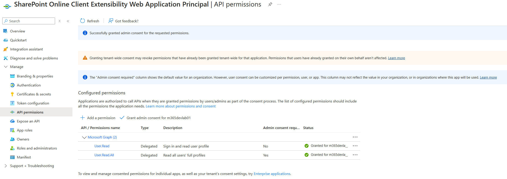

# SPFx SPO List CRUD Web Parts

## Table of Contents

- [Summary](#summary)
- [Features](#features)
- [Prerequisites](#prerequisites)
- [Applies to](#applies-to)
- [Authors](#authors)
- [Version history](#version-history)
- [Minimal Path to Awesome](#minimal-path-to-awesome)
  - [Install react and reactdom packages](#install-react-and-reactdom-packages)
- [Debugging](#debugging)
- [References](#references)
- [Graph Permissions](#graph-permissions)
  - [Grant required graph permissions in Azure Portal](#grant-required-graph-permissions-in-azure-portal)
- [Disclaimer](#disclaimer)

## Summary

This project contains SharePoint Framework (SPFx) web parts that demonstrate CRUD (Create, Read, Update, Delete) operations on SharePoint Online lists. The web parts are built using React and leverage the SharePoint REST API to interact with list data. These examples showcase how to perform basic data manipulation tasks within a SharePoint Online environment, providing a practical reference for developers looking to implement similar functionality in their own SPFx solutions.

[picture of the solution in action, if possible]

## Features

This solution contains two webparts

1. PnPJS SP CRUD
2. PnPJS React CRUD

This extension illustrates the following concepts:

- How to use getsp and getgraph modules to centrally create _sp and _graph objects using common context
- How to perform CRUD operations using pnpjs sp api on sample SP List
- How to read user details using pnpjs graph api.
- How to configure PnPJS logging.
 
> Notice that better pictures and documentation will increase the sample usage and the value you are providing for others. Thanks for your submissions advance.

> Share your web part with others through Microsoft 365 Patterns and Practices program to get visibility and exposure. More details on the community, open-source projects and other activities from http://aka.ms/m365pnp.

## Compatibility

| :warning: Important          |
|:---------------------------|
| Every SPFx version is only compatible with specific version(s) of Node.js. In order to be able to build this sample, please ensure that the version of Node on your workstation matches one of the versions listed in this section. This sample will not work on a different version of Node.|
|Refer to <https://aka.ms/spfx-matrix> for more information on SPFx compatibility.   |


-Incompatible-red.svg "SharePoint Server 2016 Feature Pack 2 requires SPFx 1.1")


For more information about SPFx compatibility, please refer to <https://aka.ms/spfx-matrix>

## Prerequisites

 

## Applies to

- [SharePoint Framework](https://aka.ms/spfx)
- [Microsoft 365 tenant](https://docs.microsoft.com/en-us/sharepoint/dev/spfx/set-up-your-developer-tenant)

## Authors

| Author(s)      |
| -------------- |
| Chirag Patel |

## Version history

|Version|Date| Comments|
|--------|-- | --------|
| 1.0.1 | March 30, 2025 | Initial Release |

> Get your own free development tenant by subscribing to [Microsoft 365 developer program](http://aka.ms/o365devprogram)

---

## Minimal Path to Awesome

### Install react and reactdom packages
> [!IMPORTANT]
> **`react@17.0.1 react-dom@17.0.1`** are required version for SPFx 1.20.1 compatibility

```PowerShell
npm i react@17.0.1 react-dom@17.0.1 --save-exact
```
> **Other dependencies to validate if *npm install* does not resolve**

``` PowerShell
npm install @microsoft/applicationinsights-web --save

npm install office-ui-fabric-react --save

npm install simple-react-validator --save

npm install @pnp/sp --save
```

> Include any additional steps as needed.

## Debugging

> [!WARNING]Debug solution locally

```PowerShell
> gulp clean
> gulp build
> gulp serve --nobrowser
```

> **Debug URL for Dev** where **`2db7bd97-c073-49ed-b9a9-13c5a5f50277`** is the extention id.

```URL
https://m365devlab01.sharepoint.com/sites/M365AppDev/_layouts/workbench.aspx
```
## Graph Permissions

### Grant required graph permissions in Azure Portal


Azure Portal App Registration: `SharePoint Online Client Extensibility Web Application Principal` or new `SharePoint Online Client Web Extensibility`

> Reference Article (March 10th, 2025)
>
> [Changes on SharePoint Framework (SPFx) permission grants in Microsoft Entra ID](https://devblogs.microsoft.com/microsoft365dev/changes-on-sharepoint-framework-spfx-permission-grants-in-microsoft-entra-id/)

We need to set the scope of the API to get the information from graph API.
Open `package-solution.json` file in config directory.
Add the below code in the `webApiPermissionRequests` array.

```json

// for this solution.
"webApiPermissionRequests": [
  {
    "resource": "Microsoft Graph",
    "scope": "User.Read.All"
  }
]

OR for multiple scopes

    "webApiPermissionRequests": [
      {
        "resource": "Microsoft Graph",
        "scope": "Directory.Read.All"
      },
      {
        "resource": "Microsoft Graph",
        "scope": "User.Read"
      },
      {
        "resource": "Microsoft Graph",
        "scope": "User.Read.All"
      },
      {
        "resource": "Microsoft Graph",
        "scope": "Group.Read.All"
    }
  ]
 
 OR if domain isolated flag is true in package solution file.

"isDomainIsolated": true,
    "webApiPermissionRequests": [
      {
        "resource": "Microsoft Graph",
        "scope": "Directory.Read.All"
      },
      {
        "resource": "Microsoft Graph",
        "scope": "User.Read"
      }
    ]    
```

## References

- [Getting started with SharePoint Framework](https://docs.microsoft.com/en-us/sharepoint/dev/spfx/set-up-your-developer-tenant)
- [Building for Microsoft teams](https://docs.microsoft.com/en-us/sharepoint/dev/spfx/build-for-teams-overview)
- [Use Microsoft Graph in your solution](https://docs.microsoft.com/en-us/sharepoint/dev/spfx/web-parts/get-started/using-microsoft-graph-apis)
- [Publish SharePoint Framework applications to the Marketplace](https://docs.microsoft.com/en-us/sharepoint/dev/spfx/publish-to-marketplace-overview)
- [Microsoft 365 Patterns and Practices](https://aka.ms/m365pnp) - Guidance, tooling, samples and open-source controls for your Microsoft 365 development

## Disclaimer

**THIS CODE IS PROVIDED _AS IS_ WITHOUT WARRANTY OF ANY KIND, EITHER EXPRESS OR IMPLIED, INCLUDING ANY IMPLIED WARRANTIES OF FITNESS FOR A PARTICULAR PURPOSE, MERCHANTABILITY, OR NON-INFRINGEMENT.**

[Go to TOC](#table-of-contents)