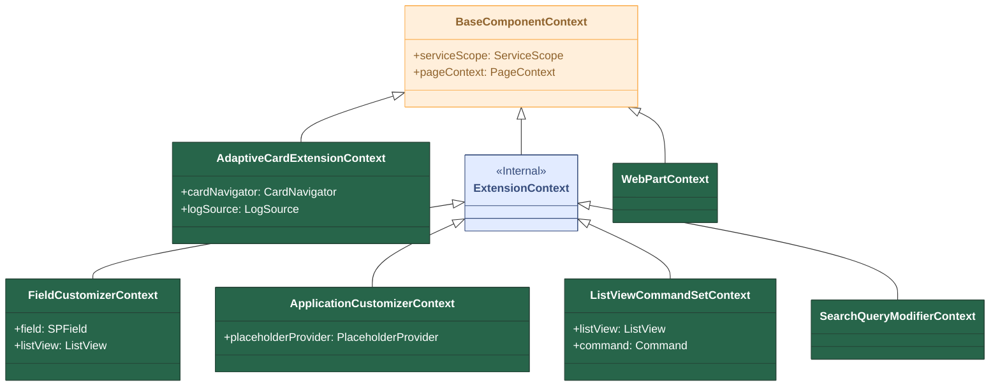

# SPFx and Graph Initialization using PnPJS options comparision

> cpateldev: @workspace /explain Explain different approaches used to initialize SPFx and Graph objects and create detailed comparison report with pros and cons.

Workspace: Here’s a detailed comparison of the different approaches used to initialize **SPFx** and **Graph** objects in your project, based on the provided files.

## Mermaid diagram (SPFx Contexts relationship)

---

### **NPM Install Commands**
These commands install the required modules for the code:
```bash
# Required for SPFx development with PnPJS
npm install @pnp/sp @pnp/graph @pnp/logging --save

# Required for SPFx extension contexts
npm install @microsoft/sp-component-base --save
npm install @microsoft/sp-application-base --save
npm install @microsoft/sp-listview-extensibility --save
npm install @microsoft/sp-adaptive-card-extension-base --save
```

### **1. pnpJSConfig.ts**
#### Code:
```typescript
import { spfi, SPFI, SPFx, ISPFXContext } from "@pnp/sp";
import { graphfi, GraphFI, SPFx as graphSPFx } from "@pnp/graph";
import { LogLevel, PnPLogging } from "@pnp/logging";

import "@pnp/sp/webs";
import "@pnp/sp/lists";
import "@pnp/sp/items";
import "@pnp/sp/batching";
import "@pnp/graph/users";

let _sp: SPFI;
let _graph: GraphFI;

export const getSP = (context: ISPFXContext): SPFI => {
  if (!!context) {
    _sp = spfi().using(SPFx(context)).using(PnPLogging(LogLevel.Warning));
  }  
  return _sp;
};

export const getGraph = (context: ISPFXContext): GraphFI => {
  if (!!context) {
    _graph = graphfi()
      .using(graphSPFx(context))
      .using(PnPLogging(LogLevel.Warning));
  }
  return _graph;
};
```

#### **Key Features:**
- Uses `ISPFXContext` as the parameter type for both SP and Graph initialization.
- Initializes both `SPFI` and `GraphFI` objects using:
    - `SPFx(context)` for SP integration
    - `graphSPFx(context)` for Graph integration
    - `PnPLogging(LogLevel.Warning)` for logging

#### **Pros:**
- **Complete Solution:** Handles both SharePoint and Graph API initialization.
- **Reusable:** Works for both SPFx web parts and extensions.
- **Type-Safe:** Uses `ISPFXContext` for better type safety.
- **Logging Support:** Includes logging with configurable levels.

#### **Cons:**
- **Global Variables:** Uses module-level variables (`_sp` and `_graph`).
- **Requires ISPFXContext:** May not be suitable when `WebPartContext` is specifically needed.
- **No Default Export:** Exports individual functions instead of a default export.

---

### **2. pnpjsGraphConfig.ts**
#### Code:
```typescript
export const getGraph = (context?: WebPartContext): GraphFI => {
  if (!!context) {
    _graph = graphfi()
      .using(graphSPFx(context))
      .using(PnPLogging(LogLevel.Warning));
  }
  return _graph;
};
```

#### **Key Features:**
- Uses `WebPartContext` as the parameter type for the `context`.
- Initializes the `GraphFI` object using:
  - `graphSPFx(context)` for SPFx integration with Microsoft Graph.
  - `PnPLogging(LogLevel.Warning)` for logging.
- Focused on **Microsoft Graph API** integration.

#### **Pros:**
- **Graph-Specific:** Tailored for scenarios where Microsoft Graph API is required.
- **Logging Support:** Includes logging with configurable log levels.
- **Optional Context:** Allows `context` to be optional, providing flexibility.

#### **Cons:**
- **Limited to GraphFI:** Does not include SPFI initialization.
- **WebPartContext Dependency:** Tied to `WebPartContext`, which may not work for SPFx extensions.

---

### **3. pnpJSConfigWebPartOnly.ts**
#### Code:
```typescript
export const getSP = (context?: WebPartContext): SPFI => {
  if (!!context) {
    _sp = spfi().using(spSPFx(context)).using(PnPLogging(LogLevel.Warning));
  }
  return _sp;
};

export const getGraph = (context?: WebPartContext): GraphFI => {
  if (!!context) {
    _graph = graphfi()
      .using(graphSPFx(context))
      .using(PnPLogging(LogLevel.Warning));
  }
  return _graph;
};
```

#### **Key Features:**
- Uses `WebPartContext` for both `SPFI` and `GraphFI` initialization.
- Provides separate methods for SP (`getSP`) and Graph (`getGraph`).
- Includes logging for both SP and Graph objects.

#### **Pros:**
- **Unified Approach:** Combines both SPFI and GraphFI initialization in one file.
- **WebPart-Specific:** Tailored for SPFx web parts.
- **Logging Support:** Includes logging for both SP and Graph.

#### **Cons:**
- **WebPartContext Dependency:** Only works for SPFx web parts, not extensions.
- **Less Reusable:** Not suitable for scenarios requiring `ISPFXContext`.

---

### **4. pnpjsSPConfig.ts**
#### Code:
```typescript
export const getSP = (context: ISPFXContext): SPFI => {
  if (context !== null) {
    _sp = spfi().using(SPFx(context)).using(PnPLogging(LogLevel.Warning));
  }
  return _sp;
};
```

#### **Key Features:**
- Uses `ISPFXContext` as the parameter type for the `context`.
- Initializes the `SPFI` object using:
  - `SPFx(context)` for SPFx integration.
  - `PnPLogging(LogLevel.Warning)` for logging.
- Focused solely on **SPFI initialization**.

#### **Pros:**
- **Simplified Approach:** Focuses only on SPFI, making it lightweight and easy to use.
- **Reusable:** Works for both SPFx web parts and extensions.
- **Logging Support:** Includes logging with configurable log levels.

#### **Cons:**
- **No Graph Support:** Does not include GraphFI initialization.
- **Requires ISPFXContext:** May not be suitable for scenarios where `WebPartContext` is specifically required.

---

### **Comparison Table**

| **Aspect**                  | **pnpJSConfig.ts**                     | **pnpjsGraphConfig.ts**              | **pnpJSConfigWebPartOnly.ts**        | **pnpjsSPConfig.ts**                |
|-----------------------------|----------------------------------------|--------------------------------------|--------------------------------------|--------------------------------------|
| **SPFI Support**            | ✅ Yes                                 | ❌ No                                | ✅ Yes                               | ✅ Yes                               |
| **GraphFI Support**         | ✅ Yes                                  | ✅ Yes                               | ✅ Yes                               | ❌ No                                |
| **Context Type**            | `ISPFXContext`                        | `WebPartContext`                    | `WebPartContext`                    | `ISPFXContext`                      |
| **Works for Extensions**    | ✅ Yes                                 | ❌ No                                | ❌ No                                | ✅ Yes                               |
| **Works for Web Parts**     | ✅ Yes                                 | ✅ Yes                               | ✅ Yes                               | ✅ Yes                               |
| **Logging Support**         | ✅ Yes                                 | ✅ Yes                               | ✅ Yes                               | ✅ Yes                               |
| **Flexibility**             | High (Generic Context)                | Medium (Graph-Specific)             | Low (WebPart-Specific)              | High (Generic Context)              |
| **Code Reusability**        | High                                  | Medium                              | Low                                  | High                                |

---

### **Recommendations**

1. **For SPFx Web Parts Only:**
   - Use `pnpJSConfigWebPartOnly.ts` if your project is exclusively focused on SPFx web parts and you need both SPFI and GraphFI support.

2. **For SPFx Extensions and Web Parts:**
   - Use `pnpJSConfig.ts` or `pnpjsSPConfig.ts` for a more generic and reusable approach that works across SPFx web parts and extensions.

3. **For Graph API-Specific Scenarios:**
   - Use `pnpjsGraphConfig.ts` if your primary focus is on Microsoft Graph API integration.

4. **Unified Approach:**
   - If you want a single configuration file for both SPFI and GraphFI, consider merging the logic from `pnpJSConfig.ts` and `pnpjsGraphConfig.ts` into one file, while keeping the context type flexible (`ISPFXContext`).

---

### **Conclusion**
Each approach has its strengths and weaknesses. The choice depends on your project's requirements:
- For **maximum flexibility and reusability**, prefer `pnpJSConfig.ts` or `pnpjsSPConfig.ts`.
- For **web part-specific projects**, `pnpJSConfigWebPartOnly.ts` is sufficient.
- For **Graph API-heavy projects**, `pnpjsGraphConfig.ts` is ideal.

Similar code found with 1 license type

cpateldev: Like WebPartContext, what can I use for SPFx Extension?

GitHub Copilot: For SPFx Extensions, you can use **`BaseComponentContext`** from the `@microsoft/sp-component-base` package. This is a more generic context type that works for all SPFx extensions, such as Application Customizers, Field Customizers, and Command Sets.

### Example:
```typescript
import { BaseComponentContext } from "@microsoft/sp-component-base";
```

You can then use `BaseComponentContext` in place of `WebPartContext` for initializing SPFI or GraphFI objects.

### Updated Code for SPFx Extensions:
```typescript
import { BaseComponentContext } from "@microsoft/sp-component-base";
import { spfi, SPFI, SPFx as spSPFx } from "@pnp/sp";
import { graphfi, GraphFI, SPFx as graphSPFx } from "@pnp/graph";
import { LogLevel, PnPLogging } from "@pnp/logging";

let _sp: SPFI;
let _graph: GraphFI;

export const getSP = (context: BaseComponentContext): SPFI => {
  if (!!context) {
    _sp = spfi().using(spSPFx(context)).using(PnPLogging(LogLevel.Warning));
  }
  return _sp;
};

export const getGraph = (context: BaseComponentContext): GraphFI => {
  if (!!context) {
    _graph = graphfi()
      .using(graphSPFx(context))
      .using(PnPLogging(LogLevel.Warning));
  }
  return _graph;
};
```

### Why Use `BaseComponentContext`?
- **Generic Context:** It works for all SPFx extensions, making it more versatile than `WebPartContext`.
- **Consistency:** Ensures your code can handle both web parts and extensions if needed.
- **Flexibility:** Allows you to reuse the same initialization logic across different SPFx components.

cpateldev: How BaseComponentContext is different from ISPFXContext? and Is there any specific context for extension type?

GitHub Copilot: ### **Difference Between `BaseComponentContext` and `ISPFXContext`**

| **Aspect**                  | **`BaseComponentContext`**                                      | **`ISPFXContext`**                                      |
|-----------------------------|---------------------------------------------------------------|-------------------------------------------------------|
| **Definition**              | A generic context provided by SPFx for all extensions.         | A specific interface provided by PnPJS for SPFx integration. |
| **Source**                  | Comes from `@microsoft/sp-component-base`.                     | Comes from `@pnp/sp`.                                 |
| **Usage**                   | Used for SPFx extensions like Application Customizers, Field Customizers, and Command Sets. | Used for initializing PnPJS objects (SPFI/GraphFI) in SPFx. |
| **Scope**                   | Broader scope, works for all SPFx extensions.                  | Narrower scope, specific to PnPJS integration.        |
| **Properties**              | Provides properties like `serviceScope`, `pageContext`, etc., which are common to all SPFx extensions. | Provides properties required for PnPJS initialization, such as `spfxContext`. |
| **Flexibility**             | Can be used for both SPFx extensions and web parts.            | Primarily used for PnPJS configuration in SPFx.       |

---

### **Specific Contexts for SPFx Extensions**

SPFx provides specific contexts for different types of extensions. These contexts inherit from `BaseComponentContext` and add additional properties specific to the extension type:

1. **Application Customizer Context**
   - **Class:** `ApplicationCustomizerContext`
   - **Source:** `@microsoft/sp-application-base`
   - **Usage:** Used for Application Customizers.
   - **Example:**
     ```typescript
     import { ApplicationCustomizerContext } from "@microsoft/sp-application-base";
     ```

2. **Field Customizer Context**
   - **Class:** `FieldCustomizerContext`
   - **Source:** `@microsoft/sp-listview-extensibility`
   - **Usage:** Used for Field Customizers.
   - **Example:**
     ```typescript
     import { FieldCustomizerContext } from "@microsoft/sp-listview-extensibility";
     ```

3. **Command Set Context**
   - **Class:** `ListViewCommandSetContext`
   - **Source:** `@microsoft/sp-listview-extensibility`
   - **Usage:** Used for Command Sets.
   - **Example:**
     ```typescript
     import { ListViewCommandSetContext } from "@microsoft/sp-listview-extensibility";
     ```

---

### **When to Use Each Context**

- **`BaseComponentContext`:**
  - Use when you want a generic context that works across all SPFx extensions.
  - Ideal for reusable logic that doesn't depend on specific extension types.

- **Specific Extension Contexts (`ApplicationCustomizerContext`, `FieldCustomizerContext`, etc.):**
  - Use when you need properties or methods specific to a particular extension type.
  - For example, `ApplicationCustomizerContext` provides access to `placeholderProvider`, which is specific to Application Customizers.

- **`ISPFXContext`:**
  - Use when working with PnPJS to initialize SPFI or GraphFI objects.
  - It is not tied to any specific SPFx extension or web part but is designed for PnPJS integration.

---

### **Example: Using `BaseComponentContext` vs. Specific Contexts**

#### Using `BaseComponentContext` (Generic):
```typescript
import { BaseComponentContext } from "@microsoft/sp-component-base";
import { spfi, SPFI, SPFx } from "@pnp/sp";

let _sp: SPFI;

export const getSP = (context: BaseComponentContext): SPFI => {
  if (!!context) {
    _sp = spfi().using(SPFx(context));
  }
  return _sp;
};
```

#### Using `ApplicationCustomizerContext` (Specific):
```typescript
import { ApplicationCustomizerContext } from "@microsoft/sp-application-base";
import { spfi, SPFI, SPFx } from "@pnp/sp";

let _sp: SPFI;

export const getSP = (context: ApplicationCustomizerContext): SPFI => {
  if (!!context) {
    _sp = spfi().using(SPFx(context));
  }
  return _sp;
};
```

---

### **Conclusion**

- Use `BaseComponentContext` for generic SPFx extension scenarios.
- Use specific contexts like `ApplicationCustomizerContext` or `FieldCustomizerContext` when working with a particular type of extension.
- Use `ISPFXContext` when initializing PnPJS objects, as it is specifically designed for that purpose.

cpateldev: What about ExtensionContext?

GitHub Copilot: In SPFx, there is no specific `ExtensionContext` class. Instead, SPFx provides specialized contexts for each type of extension, all of which inherit from the generic `BaseComponentContext`. These specialized contexts include additional properties and methods specific to the type of extension.

Here are the specific contexts for SPFx extensions:

---

### **1. Application Customizer Context**
- **Class:** `ApplicationCustomizerContext`
- **Source:** `@microsoft/sp-application-base`
- **Usage:** Used for Application Customizers.
- **Key Property:** `placeholderProvider` (used to manage placeholders like header/footer).
- **Example:**
  ```typescript
  import { ApplicationCustomizerContext } from "@microsoft/sp-application-base";

  export const getSP = (context: ApplicationCustomizerContext): SPFI => {
    if (!!context) {
      _sp = spfi().using(SPFx(context));
    }
    return _sp;
  };
  ```

---

### **2. Field Customizer Context**
- **Class:** `FieldCustomizerContext`
- **Source:** `@microsoft/sp-listview-extensibility`
- **Usage:** Used for Field Customizers.
- **Key Property:** `field` (provides metadata about the field being customized).
- **Example:**

  ```typescript
  import { FieldCustomizerContext } from "@microsoft/sp-listview-extensibility";

  export const getSP = (context: FieldCustomizerContext): SPFI => {
    if (!!context) {
      _sp = spfi().using(SPFx(context));
    }
    return _sp;
  };
  ```

---

### **3. Command Set Context**
- **Class:** `ListViewCommandSetContext`
- **Source:** `@microsoft/sp-listview-extensibility`
- **Usage:** Used for Command Sets.
- **Key Property:** `listView` (provides access to the list view being customized).
- **Example:**
  ```typescript
  import { ListViewCommandSetContext } from "@microsoft/sp-listview-extensibility";

  export const getSP = (context: ListViewCommandSetContext): SPFI => {
    if (!!context) {
      _sp = spfi().using(SPFx(context));
    }
    return _sp;
  };
  ```

---

### **When to Use These Contexts**
- Use the specific context (`ApplicationCustomizerContext`, `FieldCustomizerContext`, or `ListViewCommandSetContext`) when working with a particular type of SPFx extension.
- These contexts provide additional properties and methods that are specific to the extension type, making them more suitable than the generic `BaseComponentContext`.

---

### **Using `ISPFXContext` with Extensions**
If you are using PnPJS (`ISPFXContext`), you can pass any of these extension contexts because they all inherit from `BaseComponentContext`. For example:
```typescript
import { ApplicationCustomizerContext } from "@microsoft/sp-application-base";
import { spfi, SPFI, SPFx, ISPFXContext } from "@pnp/sp";

export const getSP = (context: ISPFXContext): SPFI => {
  if (!!context) {
    _sp = spfi().using(SPFx(context));
  }
  return _sp;
};
```

This approach works because `ISPFXContext` is compatible with any SPFx context that extends `BaseComponentContext`.

---

### **Conclusion**
- Use `ApplicationCustomizerContext`, `FieldCustomizerContext`, or `ListViewCommandSetContext` for extension-specific scenarios.
- Use `BaseComponentContext` for generic extension scenarios.
- Use `ISPFXContext` when working with PnPJS, as it is designed to work with any SPFx context.


Adaptive Card Extensions (ACEs) are part of the **Microsoft Viva Connections** framework and are built using the **SharePoint Framework (SPFx)**. They have their own specific context called `AdaptiveCardExtensionContext`.

---

### **AdaptiveCardExtensionContext**
- **Class:** `AdaptiveCardExtensionContext`
- **Source:** `@microsoft/sp-adaptive-card-extension-base`
- **Usage:** Used specifically for Adaptive Card Extensions in Viva Connections.
- **Key Properties:**
  - `cardNavigator`: Allows navigation between different cards in the ACE.
  - `logSource`: Provides logging capabilities.
  - `serviceScope`: Provides access to services registered in the SPFx service scope.
  - `pageContext`: Provides contextual information about the current page.

---

### **Example: Using `AdaptiveCardExtensionContext`**
Here’s how you can use `AdaptiveCardExtensionContext` to initialize SPFI or GraphFI objects:

```typescript
import { AdaptiveCardExtensionContext } from "@microsoft/sp-adaptive-card-extension-base";
import { spfi, SPFI, SPFx } from "@pnp/sp";
import { graphfi, GraphFI, SPFx as graphSPFx } from "@pnp/graph";
import { LogLevel, PnPLogging } from "@pnp/logging";

let _sp: SPFI;
let _graph: GraphFI;

export const getSP = (context: AdaptiveCardExtensionContext): SPFI => {
  if (!!context) {
    _sp = spfi().using(SPFx(context)).using(PnPLogging(LogLevel.Warning));
  }
  return _sp;
};

export const getGraph = (context: AdaptiveCardExtensionContext): GraphFI => {
  if (!!context) {
    _graph = graphfi()
      .using(graphSPFx(context))
      .using(PnPLogging(LogLevel.Warning));
  }
  return _graph;
};
```

---

### **When to Use `AdaptiveCardExtensionContext`**
- Use this context when developing Adaptive Card Extensions for Viva Connections.
- It provides specific properties and methods that are unique to ACEs, such as `cardNavigator` for managing card navigation.

---

### **Comparison with Other Contexts**

| **Aspect**                  | **AdaptiveCardExtensionContext**       | **BaseComponentContext**             | **ISPFXContext**                     |
|-----------------------------|----------------------------------------|--------------------------------------|--------------------------------------|
| **Scope**                   | Specific to Adaptive Card Extensions  | Generic for all SPFx extensions      | Specific to PnPJS integration        |
| **Key Features**            | `cardNavigator`, `logSource`          | `serviceScope`, `pageContext`        | `spfxContext`                        |
| **Usage**                   | For Adaptive Card Extensions          | For SPFx extensions (generic)        | For initializing SPFI/GraphFI        |
| **Flexibility**             | Low (ACE-specific)                    | High (generic)                       | Medium (PnPJS-specific)              |

---

### **Conclusion**
- Use `AdaptiveCardExtensionContext` when working with Adaptive Card Extensions in Viva Connections.
- It is specifically designed for ACEs and provides properties like `cardNavigator` that are not available in other contexts.
- If you are using PnPJS in ACEs, you can pass `AdaptiveCardExtensionContext` to methods expecting `ISPFXContext`, as it is compatible.


### **When to Use `WebPartContext`**

`WebPartContext` is a specific context provided by SPFx for **web parts**. It is part of the `@microsoft/sp-webpart-base` package and is designed to provide properties and methods that are specific to web parts.

---

### **Use Cases for `WebPartContext`**
1. **SPFx Web Parts Only**:
   - Use `WebPartContext` when developing SPFx web parts, as it provides web part-specific properties and methods.

2. **Accessing Web Part-Specific Properties**:
   - `WebPartContext` includes properties like:
     - `domElement`: The DOM element where the web part is rendered.
     - `instanceId`: The unique ID of the web part instance.
     - `manifest`: The manifest of the web part.
     - `pageContext`: Provides contextual information about the current page.

3. **PnPJS Integration**:
   - Use `WebPartContext` when initializing PnPJS objects (`SPFI` or `GraphFI`) in web parts. For example:
     ```typescript
     import { WebPartContext } from "@microsoft/sp-webpart-base";
     import { spfi, SPFI, SPFx } from "@pnp/sp";

     let _sp: SPFI;

     export const getSP = (context: WebPartContext): SPFI => {
       if (!!context) {
         _sp = spfi().using(SPFx(context));
       }
       return _sp;
     };
     ```

4. **Custom Web Part Logic**:
   - Use `WebPartContext` when you need to interact with the web part's DOM or manage web part-specific behavior.

5. **Scenarios Where Extensions Are Not Needed**:
   - If your solution is limited to web parts and does not involve SPFx extensions (e.g., Application Customizers, Field Customizers), `WebPartContext` is sufficient.

---

### **Comparison with Other Contexts**

| **Aspect**                  | **WebPartContext**                     | **BaseComponentContext**             | **ISPFXContext**                     |
|-----------------------------|----------------------------------------|--------------------------------------|--------------------------------------|
| **Scope**                   | Specific to SPFx web parts            | Generic for all SPFx extensions      | Specific to PnPJS integration        |
| **Key Features**            | `domElement`, `instanceId`, `manifest`| `serviceScope`, `pageContext`        | `spfxContext`                        |
| **Usage**                   | For SPFx web parts                    | For SPFx extensions (generic)        | For initializing SPFI/GraphFI        |
| **Flexibility**             | Low (Web Part-Specific)               | High (Generic)                       | Medium (PnPJS-Specific)              |

---

### **Conclusion**
- Use `WebPartContext` when working exclusively with SPFx web parts.
- For solutions that involve both web parts and extensions, consider using `BaseComponentContext` or `ISPFXContext` for better flexibility and reusability.